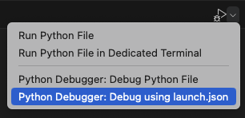
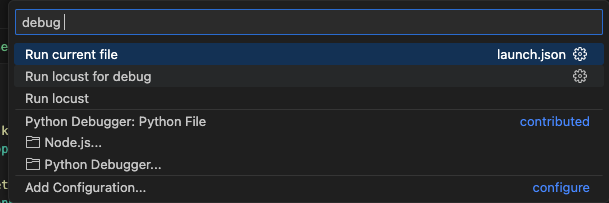

# run  
## single process 
locust

run_single_visit_user.py 파일 실행  
python app/run_single_user.py  

## master-worker
master 실행  
locust -f app/locustfile.py --class-picker --master  

worker 실행  
locust -f app/locustfile.py --worker --processes 1  

ui 없이 실행
locust -f app/locustfile.py --class-picker --master --autostart --headless --run-time 30s --spawn-rate 1  
locust -f app/locustfile.py --worker --processes 1 --users 100 --autostart --headless  


## web interface  
http://0.0.0.0:8089  


## 단일 유저로 테스트  
.vscode/launch.json에 작성  
```json  
{
    "version": "0.2.0",
    "configurations": [
        // debug용 파일 실행
        {
            "name": "Run current file",
            "type": "python",
            "request": "launch",
            "program": "${file}",
            "console": "integratedTerminal",
            "gevent": true,
            "envFile": "${workspaceRoot}/.env",
        },
        // debug용 부하 테스트 locust 파일 실행
        {
            "name": "Run locust for debug",
            "type": "python",
            "request": "launch",
            "module": "locust",
            "args": [
                "-f",
                "${file}",
                "--headless",
                "--users=1"
            ],
            "console": "integratedTerminal",
            "gevent": true,
            "envFile": "${workspaceRoot}/.debug.env",
        },
        // 부하 테스트 locust 파일 실행
        {
            "name": "Run locust",
            "type": "python",
            "request": "launch",
            "module": "locust",
            "args": [
                "-f",
                "${file}",
                "--headless",
                "--users=5"
            ],
            "console": "integratedTerminal",
            "gevent": true,
            "envFile": "${workspaceRoot}/.env",
        }, 
    ]
}
```  

  
  
